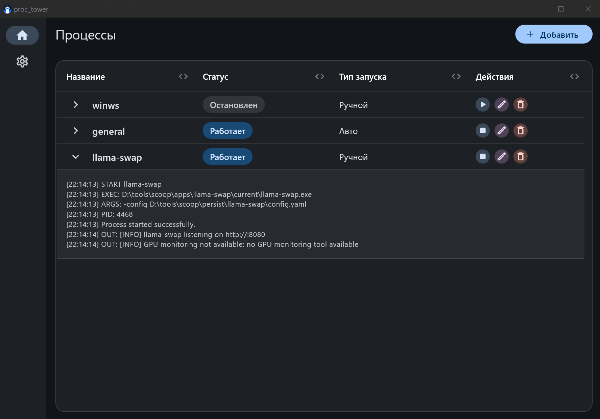
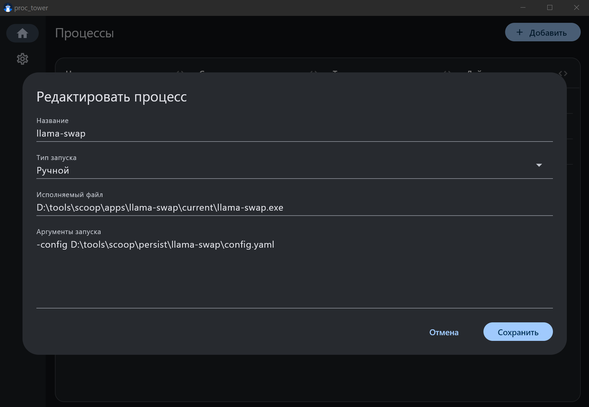

<p align="center">
  
</p>

# Proc Tower

Proc Tower is a desktop app for managing custom background processes on Windows, Linux, and macOS.

It lets you keep a list of commands, start and stop them from the UI, inspect their current status, and view process logs

## Screenshots

<div align="center">
   
</div>

## Run the project

### Install dependencies

```bash
flutter pub get
```

### Run

```bash
flutter run -d windows
```

```bash
flutter run -d linux
```

```bash
flutter run -d macos
```

### Build

```bash
flutter build windows
```

```bash
flutter build linux
```

```bash
flutter build macos
```
